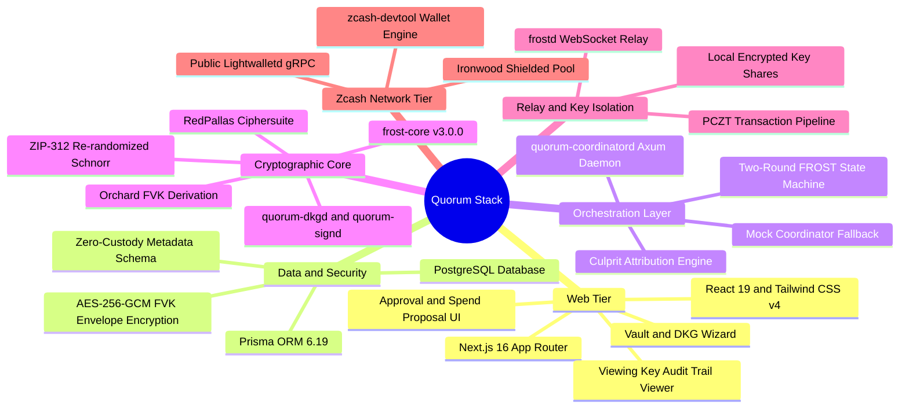
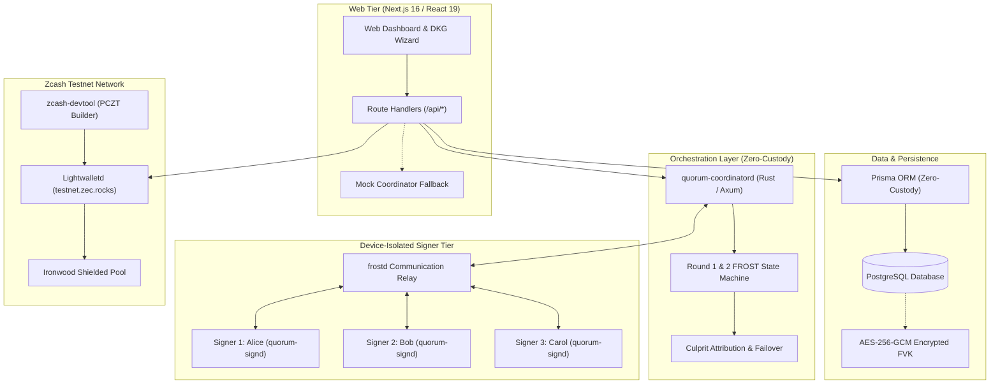

# Quorum

**Shared custody for Zcash shielded funds (Private Multisig).**

---

## Why Quorum Was Built (The Problem Background)

### The Impossible Dilemma of Shielded Custody

On transparent blockchains like Bitcoin and Ethereum, every transaction, treasury balance, and payment counterparty is visible to anyone with an internet connection. For organizations, foundations, and corporate treasuries, holding operational funds transparently leaks payroll details, vendor agreements, and financial reserves to competitors and adversaries.

**Zcash shielded pools solve this.** Using zero-knowledge cryptography (Orchard & Sapling), shielded transactions encrypt amounts, senders, and receivers directly on-chain.

**However, Zcash shielded pools have no native multisig opcode.** Unlike transparent Bitcoin scripts (`OP_CHECKMULTISIG`) or Ethereum smart contract wallets (e.g. Safe), the Zcash shielded protocol has no built-in mechanism to enforce "M-of-N" multi-party consensus on-chain.

As a result, any organization wanting to hold shielded ZEC has historically been forced into an impossible trade-off:

1. **Option A: Revert to transparent addresses (`t-addresses`).**  
   The organization can use conventional multisig, but at the cost of publishing its entire treasury balance and all transaction histories — discarding the core reason to use Zcash in the first place.
2. **Option B: Let a single individual hold the shielded seed phrase / private key.**  
   This creates a catastrophic single point of failure: employee departure, laptop theft, extortion, or insider fraud can instantly compromise the entire treasury. No financial auditor, compliance board, or GRC framework will accept single-custodian control for organizational capital.

### Why Cryptography Alone Was Not Enough

The cryptographic foundation that breaks this deadlock already exists: **FROST (Flexible Round-Optimized Schnorr Threshold)** over the RedPallas ciphersuite (specified in ZIP-312), developed and audited by the Zcash Foundation and external cryptographers. FROST allows a distributed group of participants to produce valid Schnorr signatures without the complete private key ever existing in one place.

However, raw cryptographic primitives cannot be operated by an enterprise treasury on a Monday morning:
- Non-cryptographers cannot manually coordinate low-level terminal relays or raw byte exchanges for **Distributed Key Generation (DKG)**.
- Organizations require an **approval state machine**, proposal reviews, spending limits, and multi-tier signer workflows.
- In distributed environments, signers go offline or send corrupted shares. The system must provide **deterministic culprit attribution** (identifying who failed or misbehaved) and dynamic fallback routing.
- Auditors and compliance teams require **cryptographically verifiable viewing-key audit trails** so accountants can inspect transaction histories without gaining spend authorization.

### What Quorum Delivers

**Quorum is the organizational and governance layer built over re-randomized FROST.**

We did not build the cryptography — `frost-core` v3.0.0 is audited, and the network transport exists. Quorum builds everything in between:
- **Zero Custody by Design:** The coordinator daemon and web application never see, transmit, or store private keys or key shares.
- **Threshold Security (t-of-n):** Shielded fund transfers require cryptographically verified consensus from device-isolated signer processes.
- **Auditability Without Spend Authority:** Opt-in viewing key integration enables auditable transparency for stakeholders while keeping spend keys decentralized.
- **Fault Attribution & Recovery:** Built-in detection for misbehaving or stalled signers with automatic failover to standby participants.

> **We are not building cryptography.** `frost-core` v3.0.0 is audited and stable. The
> transport (`frostd`) exists. The gap is everything between the library and an organisation
> that has to pass a controls audit. That is what we build, and that is why 26 days is realistic.

---

## Technical Stack & Architecture Mindmap



### Component Interaction & Trust Boundaries



---

## Quickstart & System Usage Guide

### 1. How Quorum Works (The Mental Model)
- **Zero Custody:** The coordinator server never sees or stores key shares.
- **FROST Threshold Scheme (2-of-3):** 3 participants (Alice, Bob, Carol) hold device-isolated key shares. Any transfer requires consensus from at least 2 signers.
- **Viewing-Key Audit Trail:** Transactions are verified on-chain via Zcash Viewing Keys, providing cryptographically verifiable reports for auditors without granting spending authority.

### 2. The part that is actually cryptography

The web tier is one half. The other half is three OS processes that hold key shares and
a coordinator that holds none — and that is where the claim lives. Full sequence from a
clean machine, every command verified on 25 Sep, in **[docs/16-runbook.md](docs/16-runbook.md)**.

```bash
# a key ceremony in three processes, over a real frostd
./scripts/three-party-ceremony.sh ./secrets/ceremony

# three signers, one sealed share each; the coordinator sees neither
./scripts/three-signer-demo.sh ./secrets/ceremony <pczt>
```

### 3. Running the Web Application Locally

```bash
# 1. Start the local PostgreSQL service
docker compose up -d postgres

# 2. Run Prisma database migrations & seed demo state
pnpm db:deploy
pnpm db:seed
# Or reset everything in one command:
# pnpm fixture:reset

# 3. Start the Next.js development server
pnpm dev
```
Open **[http://localhost:3000](http://localhost:3000)** in your browser.

### 4. Exploring the System via Web UI

> **Signing in the UI is simulated unless `COORDINATOR_URL` is set.** With it set, the
> app reads authoritative state from `quorum-coordinatord`; without it, a mock stands in
> and the interface says so on screen. We would rather label it than have you discover it.
- **Dashboard (`/`):** View your 2-of-3 threshold vault metrics and active spend proposals.
- **Pending Approvals (`/approvals` & `/approvals/req-demo-001`):**
  - View the proposal requiring 2-of-3 consensus (Alice has already approved).
  - Click **"Sign as Bob"** to collect the 2nd signature and watch the quorum complete. In mock mode no transaction is broadcast — the real broadcast path is the runbook's step 5.
- **Interactive Edge-Case Sandbox (Bottom-Right Panel):**
  - **Normal Flow:** 2 signers collaborate smoothly.
  - **Bob Offline / Timeout:** Demonstrates switching to **Carol (Standby Signer)** when Bob is unavailable.
  - **Corrupt Share (F4 Culprit Detection):** Demonstrates automatic rejection and mathematical identification of a compromised device without risking treasury funds.
- **Key Ceremony Simulation (`/vaults/.../ceremony`):** Step through the distributed key generation (DKG) process.

---

## Status

| | |
|---|---|
| **Phase** | Phase 4 — release. Protocol core, coordinator and web tier are built; 42 tests. |
| **On chain** | A 2-of-3 threshold-signed shielded **Ironwood** spend, from a vault whose three shares were never in the same process: txid [`259242c6…3a61`](https://testnet.zcashexplorer.app/transactions/259242c6d3c518224627e6b7b7488191d4cbbb32dfd84c2e09e144f9410b3a61), block 4,390,493 |
| **Next action** | P4-2 — record the demo, from 5 Oct. See [docs/16-runbook.md](docs/16-runbook.md). |
| **Hackathon** | Colosseum Crypto World's Fair, Zcash track |
| **Window** | 14 Sep – 12 Oct 2026 · submitting 10 Oct |
| **Target** | Top 10 of the Zcash track ($10,000). General pool is a lottery ticket, not a plan. |
| **Network** | **Testnet only. No mainnet funds, ever, during this build.** |

---

## Read in this order

| Doc | What it settles |
|---|---|
| [00-plain-english.md](docs/00-plain-english.md) | The project explained without jargon — the public-facing overview |
| [01-strategy.md](docs/01-strategy.md) | Why the Zcash track, how we're positioned, how we score against each judging criterion |
| [02-product-spec.md](docs/02-product-spec.md) | The problem, the flows we build, and the hard scope boundary |
| [03-architecture.md](docs/03-architecture.md) | Components, trust boundaries, what never touches our server |
| [04-technical-constraints.md](docs/04-technical-constraints.md) | Non-negotiable technical facts, verified Sept 2026, with failure modes |
| [05-plan.md](docs/05-plan.md) | The five hard gates and the reasoning behind them |
| [10-roadmap.md](docs/10-roadmap.md) | **Every task, estimated, assigned to a developer, with dependencies** |
| [06-risk-register.md](docs/06-risk-register.md) | What kills this project and what we do instead |
| [07-demo-script.md](docs/07-demo-script.md) | The three-minute video, beat by beat |
| [08-prior-art.md](docs/08-prior-art.md) | Exact crates and repos — what to build on, what never to rebuild |
| [09-traction.md](docs/09-traction.md) | The one judging criterion we cannot earn by coding |
| [13-phase-1-plan.md](docs/13-phase-1-plan.md) | **Phase 1 execution plan — day by day to Gate B** |
| [16-runbook.md](docs/16-runbook.md) | **Clean machine to a confirmed spend — every command, verified** |
| [17-loi-drafts.md](docs/17-loi-drafts.md) | Outreach drafts, ready to send, written against the R6 honesty rules |
| [18-video-agent-master-prompt.md](docs/18-video-agent-master-prompt.md) | **Hand this whole file to whoever produces the demo video** |
| [19-after-submission.md](docs/19-after-submission.md) | What we deferred past the deadline, and why — written before it, so a deferral cannot pass for an oversight |
| [12-spike-s1-report.md](docs/12-spike-s1-report.md) | **Spike S1 findings — what actually works, what was broken, what is still open** |
| [11-contract-review.md](docs/11-contract-review.md) | Open questions on the coordinator contract — resolve before 22 Sep, then delete |

[CLAUDE.md](CLAUDE.md) is the persistent context for Claude Code sessions. It is loaded
automatically; you do not need to paste a brief.

---

## The three things that kill this project

1. **Targeting the wrong pool.** Orchard went exit-only on 28 July 2026. A demo that spends
   from Orchard is demoing a deprecated pool in front of the community that deprecated it.
   **We target Ironwood.** See [04-technical-constraints.md](docs/04-technical-constraints.md).

2. **The happy path never lands.** PCZT v2 + Ironwood support sits on release candidates with
   open upstream issues. If a 2-of-3 shielded spend does not confirm on testnet by **27 Sept**,
   we switch to the degraded demo defined in [06-risk-register.md](docs/06-risk-register.md).
   Everything else is decoration.

3. **The demo is rushed.** Hackathon projects lose because the video was recorded at 2am on
   deadline day, not because the code was bad. **Feature freeze 4 Oct. Recording starts 5 Oct.
   Submit 10 Oct**, two days early.

---

## Security posture — read before writing any claim

`frost-core` is audited by NCC Group. **`frost-rerandomized` is not covered by that audit** and
its documentation still carries an API-may-change warning. ZIP-312 is still a Draft.

Never describe this project as audited, production-ready, or safe for mainnet funds. Overstating
the security posture of a custody product is the worst failure mode available to us — worse than
missing the deadline. When unsure whether something is audited, write that we are unsure.
