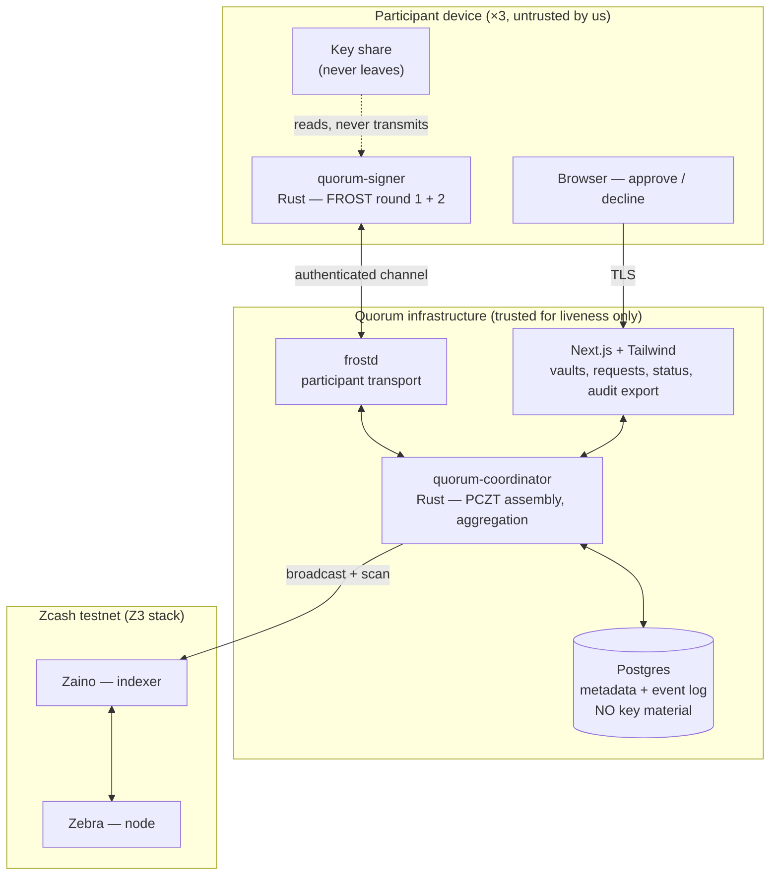
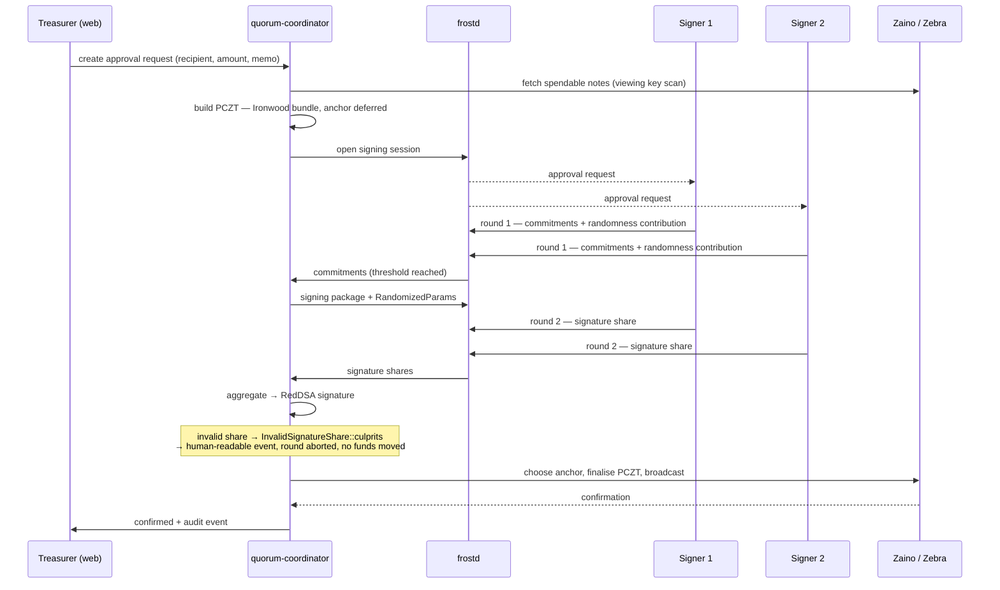

# 03 — Architecture

---

## 1. Components

| Component | Language | Role |
|---|---|---|
| `quorum-signer` | Rust | Runs on the participant's machine. Holds the share. Performs FROST round 1 (commitments) and round 2 (signature share). Never transmits the share. |
| `quorum-coordinator` | Rust | Builds PCZTs, drives the FROST coordinator role, aggregates shares, broadcasts. Holds no key material. |
| `frostd` | Rust (upstream) | Participant transport. **Do not rebuild.** |
| Web app | Next.js + Tailwind | Vault management, approval requests, signer status, misbehaviour surfacing, audit export. The entire product from the treasurer's point of view. |
| Postgres | — | Vault metadata, participant identities, request state, event log, viewing keys. **No shares. No spend authorizing key. Ever.** |
| Zebra + Zaino | Rust (upstream) | Node and indexer. Z3 stack; `zcashd` is retired. |

## 2. Trust boundaries — the part that must be right

This is a custody product. The trust model is the product; everything else is user interface.

### What our infrastructure can do

- See vault metadata, participant identities, and approval history.
- See transaction contents it helped construct.
- Refuse to relay — a **liveness** attack. We can stall a signing round.
- Hold viewing keys if the organisation chooses to store them with us for audit export.

### What our infrastructure cannot do

- **Move funds.** Not unilaterally, not in collusion with any single signer. Below threshold the
  signature does not exist; this is enforced by the mathematics, not by a permission check in
  our code.
- **Reconstruct the spending key.** No share ever reaches us.
- **Forge an audit record** that survives independent verification, because the record is
  derived from the viewing key and checkable on-chain by anyone holding it.

### What our infrastructure must never hold

Key shares. The aggregated spend authorizing key. Seed phrases. Share backups. No exceptions,
no "temporarily for convenience", no "encrypted at rest so it's fine."

> **Implementation rule.** If a code path would cause share material to cross the process
> boundary into `quorum-coordinator` or the web app, that path is wrong. Not "needs review" —
> wrong. This is the single invariant that makes the legal and security posture in
> [01-strategy.md](01-strategy.md) §7 true rather than aspirational.

### Channel requirements — a first-class requirement, never a TODO

| Phase | Requirement | Why |
|---|---|---|
| **DKG** | Authenticated **and confidential** | Round-1 packages carry material that leaks secrets if observed, and an unauthenticated channel permits a man-in-the-middle who ends up in the vault. Getting this wrong at key generation silently poisons every signature afterwards. |
| **Signing** | Authenticated only | Commitments and signature shares are not secret, but a substituted share breaks the round or, worse, is attributed to the wrong participant. |

`frostd` provides the transport. **Verify what it actually guarantees during spike S1** rather
than assuming — confirm TLS, confirm how participants are authenticated to each other and not
merely to the server, and write the answer into this document.

## 3. Signing round — data flow

Two details that are easy to get wrong:

- **All signing parties contribute randomness.** The v3 rerandomized API was reworked
  specifically so randomness is not supplied by a single party. Do not reintroduce a
  single-source randomizer for convenience.
- **The anchor is chosen at broadcast, not at build.** See
  [04-technical-constraints.md](04-technical-constraints.md) §3. Building the anchor in early
  and rebuilding the transaction when it goes stale would discard collected signatures — the
  exact failure v6 removes.

## 4. Storage model

| Data | Where | Notes |
|---|---|---|
| Key share | Participant device only | Encrypted at rest with a passphrase the participant sets. Never transmitted, never backed up by us. |
| Vault metadata, participants, threshold | Postgres | |
| Approval requests, signer state, events | Postgres | Application event log — supporting evidence, not proof. |
| Viewing key | Postgres, **opt-in per vault**, **encrypted at rest** | Enables audit export. Grants visibility, never spend authority — but a full viewing key reveals the vault's entire transaction history, so plaintext storage would be a privacy breach. AES-256-GCM envelope encryption via `apps/web/src/lib/viewing-key-crypto.ts`, key from `VIEWING_KEY_ENCRYPTION_KEY`. This protects a leaked dump or backup; it does **not** protect an attacker holding both the database and the environment. Must be an explicit, explained choice in the UI, not a default. |
| Transaction history for audit | Derived on demand from viewing key via Zaino | The authoritative record. Never reconstructed from the event log. |

## 5. Stack

| Layer | Choice |
|---|---|
| Signing / coordination core | Rust — `frost-core` v3.0.0, `frost-rerandomized`, `reddsa` (RedPallas ciphersuite) |
| Zcash integration | `librustzcash` — `zcash_client_backend`, `zcash_keys`, `zcash_address`, `pczt` |
| Transport | `frostd` |
| Node + indexer | Zebra + Zaino (Z3 stack) |
| Web | Next.js + Tailwind |
| Database | Postgres |
| Dev environment | Docker Compose |

Pin exact crate versions and commit `Cargo.lock`. PCZT v2 + Ironwood support is on release
candidates; chasing upstream mid-hackathon is a documented failure mode, not diligence.

## 6. Infrastructure — P0-B1, decided 19 Sep 2026

**Decision: the public testnet endpoint `testnet.zec.rocks:443`.**

Self-hosting Zebra + Zaino costs ~30 GB and a 2–12 hour initial sync before any product work can
start. With Gate A two days out and P0-A4 — the task that owns risk R1 — blocked on node access,
that day is not available to spend.

### Verified before choosing

Queried directly over gRPC on 19 Sep 2026, not taken from documentation:

| Check | Result |
|---|---|
| Block height | 4,367,867 — **233,867 blocks past** testnet Ironwood activation (4,134,000) |
| Backend | `/Zebra:6.3.0/` — Ironwood support landed in Zebra 6.0.0-rc.0 |
| `CompactTx` field 9 | **`ironwoodActions`** present — light clients can scan the Ironwood pool |
| `ChainMetadata` field 3 | **`ironwoodCommitmentTreeSize`** present |
| Ironwood tree size | **307,456 notes** — the pool is in real use on testnet |
| `GetTreeState` | returns `ironwoodTree` — this is our anchor source |
| `SendTransaction` | available — broadcast path confirmed |

Scanning, anchors and broadcast are all served. `testnet.lightwalletd.com:9067` is down;
`lwd.testnet.zec.pro:443` is up but refuses gRPC reflection, so it could not be verified.

### What we accept

A third-party dependency on the two days that matter — Gate B and the demo recording. Version
and rate limits are outside our control, and the operator sees our scanning queries (testnet
only, so no real privacy loss, but worth naming in a privacy product).

**Mitigation, and it is not "run the fallback now":** keep the Z3 `docker-compose` stack tested
and ready to start. If the endpoint fails on 5 October we lose a day, not the demo. Running it
today would cost a day we do not have, to insure against a risk that may never arrive.

### Revisit if

- The endpoint rate-limits our scanning during Phase 1, or
- It is unreachable at any point during Phase 3, or
- `zcash_client_backend 0.24.0-rc.1`'s proto turns out not to match field 9 (a P0-A4 check).

Any of those triggers a same-day switch to the self-hosted fallback.

### Also considered

**Local Regtest** (Z3, instant blocks, Ironwood activatable at height 1, no faucet needed) is
genuinely attractive for P1-B3's reproducible fixture and would remove the P0-B3 dependency
entirely. It is not the choice for the demo: a private chain produces no public explorer link,
and "it works on my own chain" is materially weaker evidence in front of a Zcash-track judge
than a confirmed testnet transaction. Worth adding in Phase 2 **alongside** testnet if fixture
resets start costing real time — not instead of it.
